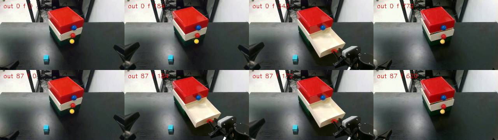
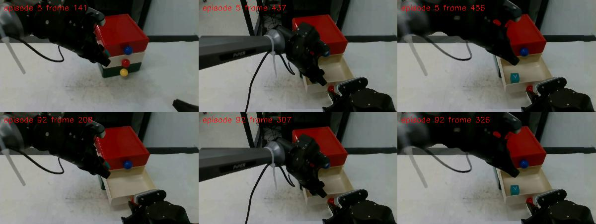

# 抽屉任务均匀时序采样：故障与交接记录

这份记录描述上一轮实际执行过的工作，不表示 174 集已完成。接手者应先复核语义和视觉证据，再决定修复路径。只需把本文件发给另一个对话；无需另建任务或重跑整批才能了解现状。

## 1. 用户原始需求与验收边界

- 基线提交：`c10dba7`。任务：把物体放进抽屉。
- A：拿起物体并举到放入前的最高点；B：拉开抽屉；C：放入物体。
- 只采样 A/B 的相对时序。C 必须等 A、B 都完成后才开始；后续关屉仍需等左臂退出。
- 区间左端：A 刚好全部在 B 前；右端：B 刚好全部在 A 前。
- 每个源 Episode 生成两个变体，位置差恰为归一化区间的 `0.5`。87 个源 Episode 对应最终 174 个采样 Episode。
- 不能扩展 B 为“拉开以后右手所有夹爪调整”，不能为凑数量复制成功 Episode，也不能把失败日志或空占位当成 Episode。
- 当前实现采用 `[0,1)` 网格，右端点只作为边界，不实际取到；视频帧量化使单个相对启动时刻最多误差 0.5 帧。

## 2. 当前代码与运行环境

采样实现提交为 **`d7d4286`**，已推送 `origin/main`，并同步到用户本地。此交接文档随后作为独立文档提交；运行结果对应的代码仍是 `d7d4286`。

| 项目 | 位置/值 |
| --- | --- |
| 执行机器 | coder A，hostname `evo-rl`，用户 `coder` |
| 工作仓库 | `/home/coder/share/real-robot-data-retime-main` |
| Python | `/home/coder/share/real-robot-data-retime/.venv/bin/python` |
| 原始数据 | `/home/coder/share/retime-interaction-20260909/drawer` |
| 已有 RGB trim | `/home/coder/share/retime-interaction-20260909/drawer-trimmed` |
| 本轮产物根目录 | `/home/coder/share/drawer-uniform-174-20260911` |
| RoboVisualize | `/home/coder/share/robo-visualize/src` |
| URDF | 仓库的 `assets/piper_x_description.urdf` |
| Mesh | `/home/coder/share/robo-visualize/src/robo_visualize/arms/piperx/assets` |

原始 HF 数据集：<https://huggingface.co/datasets/Travor278/piperx-put-cube-in-drawer-20260908-87ep>。
记录的源 revision 为 `58bbbd720f6e78d162b8f4bc7077759d34c5162f`，来自已有 `drawer_source.json`。本地数据目录不是 Git checkout，不要在其中用 `git rev-parse` 当作源版本验证。

原始数据：87 集、54,463 帧、30 FPS、87 个 Parquet、261 个 RGB 视频。现有 trim：仍为 87 集、53,796 帧。导出使用 trim，保存映射回 raw 的偏移。没有上传输出数据集。

交接时未发现本轮 `uniform_drawer` 或重新分析的 Python 作业仍在运行。

## 3. 已实现什么，以及哪些决策是本轮新增的

查看 `git diff c10dba7..d7d4286`，主要文件如下：

- `src/real_robot_data_retime/timeline/uniform.py`：每源两点、启动延迟计算、实际时序验证。
- `src/real_robot_data_retime/timeline/visual.py`：给现有分阶段 `plan_visual` 增加 `uniform_position`，复用其调度/合成路线。
- `src/real_robot_data_retime/timeline/smooth.py`：增加 `held_grasp_interval`。
- `src/real_robot_data_retime/tasks/drawer_constraints.py`：抽出 drawer interior 检测供复用。
- `src/real_robot_data_retime/uniform_drawer.py`：plan/render/finalize 入口及来源核验。
- `src/real_robot_data_retime/automatic_dataset.py`：抽出共享 telemetry/wrist 导出函数；finalize 支持显式输出 Episode 列表。
- `tests/test_uniform_drawer.py`、`docs/uniform-drawer.md`。

公式：`u=(i+variant*N)/(2*N)`，`variant∈{0,1}`；`delta=t_B-t_A=T_A-u*(T_A+T_B)`。输出编号为 `i` 和 `i+N`。这与旧 `4N` 网格奇偶筛选的逐源分配不完全相同，但满足用户确认的全局均匀、每源两点和半区间间隔，也消除了偶数 N 时某些源分不到两个样本的问题。

**本轮新增、需要接手者审查的实现选择：**

1. 两个变体都使用 A 峰值处同一套 0.5 s 刹停 / 0.3 s 恢复时钟，即使其中一个不需要实际驻留。目的是让 A 的时长不因变体改变；用户没有额外要求所有变体强制执行这套固定刹停，因此这会扩大预检失败范围，应审查是否是最佳实现。
2. 均匀模式用记录的夹爪闭合到首次重新张开区间选峰值，避免迟到的视觉 `grasp_frame` 把真正峰值排除。这个方法仍依赖正确的目标/拾取事件，不能证明夹爪里有目标物；Episode 0 已暴露空夹爪闭合误判。
3. 均匀模式不再直接把二维投影“进入抽屉”的时刻作为峰值搜索的上界，而是在上述持物候选区间内做几何筛选。视频投影边界可能早于实际举高，但该改变是否对所有 Episode 正确还没有验证。
4. 最终保留主 staged 路线的二维轮廓检查及最高点/刹停段几何检查。临时增加的整条 state/action 网格检查和右臂 settled-hold 改动已经撤回。

原有 `automatic_dataset` 使用另一套 joint-collision 规划和 depth 渲染；本轮没有直接让旧均匀完整双臂采样器处理抽屉，也没有把这两条不同路线假装成同一个已验证流水线。

## 4. 最终全量预检结果（以此为准）

[完整逐源失败清单](preflight-summary.json) 是 `d7d4286` 下最后一次正式定义区间的结果：

- 87 个源 Episode 全部做了预检。
- 10 个源 Episode 的两个变体均通过 plan：`0, 3, 5, 13, 49, 52, 53, 70, 81, 84`。
- 77 个源 Episode 未能完成两个变体的 plan。
- 这里的通过只表示该代码的检查通过，**不等于正确识别物体，更不等于视觉合成正确**。源 0 就在后续视频检查中被否决。

| 首个失败原因（每源计一次） | 数量 |
| --- | ---: |
| `NoSafeSchedule: no safe schedule preserving source trajectories and priority` | 36 |
| `0.5 second braking path leaves safe held interval` | 34 |
| `interpolated braking pose enters drawer sweep` | 4 |
| `no safe held lift peak before drawer entry` | 1 |
| `restart ramp must retain the held object` | 1 |
| `no settled recorded jaw closure after visual pickup` | 1 |

以上不能解释成“77 集原始任务物理不可行”。分析边界、分割、几何代理、固定刹停约束或规划本身都可能导致拒绝，目前没有逐集区分根因。一次源处理在首个异常停止，因此也不能把 77 简单乘二解释成已独立验证的失败变体数。

## 5. 最关键的已确认问题：Episode 0 的错误目标通过了自动检查

[机器可读的分析与计划对照](episode-evidence.json) 保存了三套分析的真实字段。不同分析中的 object_id 不能按编号直接等同，origin 坐标也属于各自配准后的画面。

| 分析 | object_id | origin 约值 | approach | pickup | grasp | release |
| --- | ---: | --- | ---: | ---: | ---: | ---: |
| 旧 `release-current/episode_000` | 0 | (238.15,316.61) | 156 | 301 | 334 | 386 |
| 此前已验收 `drawer_0-final-photometric` | 1 | (238.28,302.80) | 172 | 297 | 297 | 382 |
| 本轮重新分析 `analysis/episode_000` | 0 | (59.97,322.66) | 25 | 177 | 177 | 387 |

旧分析的视觉抓取确认 334 晚于实际持物举高峰值 322，这是已观察到的边界错误。原始 state 的第 322 帧 TCP Z 约 `0.233995 m`，夹爪约 `35.2 mm`；此前已验收预览也选用了该峰值。

但是，本轮重新运行当前分析代码得到的目标已经换成了错误候选。最终导出的源 0 计划实际是：

- `recorded_grasp_frame=177`，`recorded_reopening_frame=208`；
- `holding_aperture_limit_mm≈0.6`，表现为空夹爪闭合而非夹着立方体的约 35 mm 开度；
- **`peak_source_frame=202`，不是 322**；
- 计划和数值/自动 origin 检查均通过；输出 0 为 780 帧，输出 87 为 621 帧。

视觉检查发现：所谓“举高”时左臂没有正确出现在合成画面中，真正的蓝绿色立方体仍留在桌上。这直接否决了两条输出作为合格任务样本的资格。



**确认到的故障链：**错误目标/错误拾取事件进入下游 → 新夹爪区间逻辑接受了空夹爪闭合 → 选到错误峰值 202 → 数学上的依赖关系与映射检查仍然通过 → 实际合成语义错误。左臂消失具体由哪一份 masks/ownership/合成规则造成尚未定位，不能仅归因于某一函数。

我之前部分进度把“计划通过”表述得过于接近“正确样本已完成”；以这里记录的视觉否决和实际 `peak_source_frame=202` 为准。147 个测试通过也没有覆盖/证明这个真实 Episode 的语义正确性。

失败输出的正常 receipt 已移到 `dataset/meta/rejected_visual_receipts/episode_000.json` 和 `episode_087.json`，保留 `visual_review.passed=false`。视频与 Parquet 仍保留供诊断，不要因为文件存在就拿来训练。正常 receipt 缺失会阻止完整 finalize。

## 6. 当前有用的正对照：源 Episode 5

输出 5、92 来自同一个源 5，两个相位是 `0.028735632183908046` 和 `0.5287356321839081`，相差 0.5。

| 指标 | 输出5 | 输出92 |
| --- | ---: | ---: |
| 输出帧数 | 685 | 555 |
| 左臂启动输出帧 | 0 | 67 |
| 右臂启动输出帧 | 130 | 0 |
| A 完成输出帧 | 141 | 208 |
| B 完成输出帧 | 382 | 252 |
| C 开始输出帧 | 382 | 252 |

A 时长 141 帧、B 时长 252 帧，区间宽 393 帧。理想半宽 196.5 帧，实际相对启动差为 197 帧，属于半帧量化误差。

已核对全部 action/state 与各自源时钟的插值映射、Episode 编号、时间戳，以及三个视频的帧数/FPS。还抽查了阶段画面：输出5的 141/437/456 帧，输出92的 208/307/326 帧，能看到左臂保留、物体从桌上移走并出现在抽屉内。**这是数值与阶段截图检查，不是逐帧视频质量认证或物理碰撞认证。**



见 [数值检查](pilot-validation.json)、[抽查帧](pilot-005-review-frames.json)。目前 `dataset/meta/retime_receipts/` 只有 `episode_005.json`、`episode_092.json`。没有完成全局 dataset finalize，不能把该目录当作完整 LeRobot 数据集。

## 7. 实际执行过程与已撤回的尝试

1. **核对仓库和源数据。** 从 `c10dba7` 开始，源数据在 coder A。发现 `release-current` 有 87 份 report，但只有 82 份交互分析成功；失败源为 1/4/33/45/49。
2. **寻找同源已有成功分析。** 为这五集选取其他 source-video hash 匹配且 report gates 通过的 checkpoint，具体映射在 [config.json](config.json)。“成功”仅指当时的自动交互分析。
3. **接入现有 staged 规划与共享导出。** 第一版旧边界全量预检只有 7 个源通过：5/10/13/52/53/70/81。先导出源5的一对作为导出链路试验。
4. **分析峰值/抓取边界。** 源0旧 `grasp_frame=334` 排除了真正的 322 峰值；部分源的二维 entry gate 也过早。例如当时诊断中，源2 grasp=278、gate=301、eligible为空；源6 grasp=360、gate=368、eligible为空。添加夹爪闭合区间逻辑后，中间一轮约 9/87 通过，但它不能解决错误目标身份。
5. **重新分析源0。** 用当前主入口对原生 trim 视频运行，无手工提示，约 667 秒完成。自动 gates 全通过，却产生了第5节所述的错误对象事件。不要把“重新运行最新代码”默认当作修复成功。
6. **临时探索更严格的三维与时钟方案。** 尝试整条 state/action swept mesh 检查、随当前右臂位置的 drawer body 检查、保留右手开屉后的微调、选择稳定 open hold，以及固定的 prerequisite 调度。它们没有解决全量任务；更严格模型也会拒绝一些记录中的姿态。
7. **撤回扩大 B 的方案。** 稳定 open hold 把 B 延长到拉开后的调整/等待，改变了用户定义，不能为使检查通过而采用。临时源0输出 959/775 帧属于这个实验，**不是最终采样结果**。最终源码已撤回整条三维检查、`settled_open_hold`、动态 drawer approach 和固定调度的实验实现。
8. **按正式区间重新跑全量预检和 pilot。** 最终 `d7d4286` 结果为10/87通过、77失败。源0的780/621帧输出被视觉检查否决。源5重新导出并进行数值/截图检查，保留为正对照。
9. **提交、同步、停止在未完成状态。** `d7d4286` 远端提交并推送后，本地立即通过 Git fast-forward 同步。测试147 passed、4 skipped；没有完成174集，也没有发布到HF。

[早期原始帧诊断图](source-peak-investigation.jpg) 中有部分按旧边界选出的“最大高度”实际已是松爪后撤回，不能把整张图当成正确的 A 峰值标注。

### 过程记录中的限制与我造成的额外问题

- 多轮实验复用了 `plan-NNN.log/.exit` 名称，早期日志有覆盖。`geometry-experiment-logs/` 是撤回时的混合快照，部分末尾源保留了上一轮日志；不能把目录里87个 exit 文件当成某个临时方案的统一完整结果。正式当前 `preflight-summary.json` 才是最后一次完整87集统计。
- 曾短暂启动两个源0 plan 写同一工作目录，发现后停止重复任务，最终正式 cohort 和导出重新核验。接手请使用独立 work/output，避免并发写同一 Episode。
- 我投入了过多精力尝试几何/调度变体，较晚才识别出重新分析后的错误目标。更短的排查顺序应是先核验对象身份和代表帧，再追查时序和几何。
- 没有证据证明77个失败源都需要全量重新分割，也没有证据证明仅放宽碰撞检查就能完成正确174集。
- 没有实现或验证“忽略失败后导出174集”的路径，也没有取得用户对降低交付标准的答复。上轮曾问过是否先修复或生成带失败标记的离线审阅版本；不能把未回答或预选项当成授权。

## 8. 关键路径、日志与检查点

以下除本目录快照外，均位于 coder A。令 `R=/home/coder/share/drawer-uniform-174-20260911`：

| 内容 | 路径 |
| --- | --- |
| 当前配置和完整最终统计 | `$R/config.json`、`$R/preflight-summary.json` |
| 最终逐源预检 | `$R/plan-000.log` 到 `plan-086.log` 及对应 `.exit` |
| 计划和左右源时钟 | `$R/work/episode_NNN/plan_0.json`、`plan_1.json`、`mapping_0.npz`、`mapping_1.npz`、`planned.json` |
| 本轮错误源0分析 | `$R/analysis/episode_000/`；日志 `$R/analyze-000.log` |
| 最终渲染日志 | `$R/render-000.log`、`$R/render-005.log` |
| 导出视频 | `$R/dataset/videos/observation.images.top/chunk-000/file-NNN.mp4`（另有 left_wrist/right_wrist） |
| 导出数值与映射 | `$R/dataset/data/chunk-000/file-NNN.parquet`；`meta/retime_source_indices/episode_NNN.npz` |
| 有效 pilot receipt | `$R/dataset/meta/retime_receipts/episode_005.json`、`episode_092.json` |
| 视觉否决 receipt | `$R/dataset/meta/rejected_visual_receipts/episode_000.json`、`episode_087.json` |
| 最终测试 | `$R/tests-final.log` |
| 早期峰值诊断 | `$R/peaks.log`、`peak-gates.log` |
| 调度/三维探索诊断 | `$R/schedule-obstructions.log`、`metric-obstructions.log` |
| 撤回代码与中间文件 | `$R/geometry-experiment-code/`、`geometry-experiment-logs/`、`geometry-experiment-work/` |
| 早期/临时导出 | `$R/diagnostic-pilots/`；不要与最终 `dataset/` 混用 |
| 诊断脚本持久副本 | `$R/handoff-diagnostics/`（原脚本在 `/tmp`，已复制防丢失） |

历史诊断脚本与当时的临时实现耦合，其中有用于定位问题的 monkeypatch，不是正式生产规划器。`geometry-experiment-code/tracked.diff` 基于当时的 `c10dba7` 工作树，不应直接套用到当前 `d7d4286`；这些撤回实验没有作为最终实现提交。

某个失败源可能留下单个 variant 的 map/plan；只有匹配当前来源与 producer 的 `planned.json` 才说明两个变体处理完整。源码改变会改变 `producer_fingerprint()`，旧计划可能因此拒绝渲染，须针对目标源重新 plan。

### 应重点对照的源0已验收资产

- 分析：`/home/coder/share/retime-accuracy-20260910/drawer_0-final-photometric`。
- 对应输入：`/home/coder/share/retime-interaction-20260909/samples/drawer_0.mp4`。
- 已有预览：`/home/coder/share/retime-staged-drawer-20260911/final-wait`、`early`。
- 说明：仓库 `docs/staged-drawer.md`。

**来源核验陷阱：**已验收分析的输入是640×362的 sample 视频，原生 trim top 是848×480；二者虽都有634帧，视频 SHA 与配准 SHA 不同。直接把这个 checkpoint 填到原生视频路径上会触发 `analysis video differs from source`。不能直接改 hash 绕过核验；若复用，应先证明时间/几何对应并明确记录派生关系。分辨率/重编码是否导致当前识别偏差只是待检假设，尚未证实。

## 9. 安全复现方式（不要覆盖原故障证据）

按 coder 技能连接 A；本机只读代码，修改和执行在 coder A。连接入口为用户已有 `~/.codex/skills/coder/scripts/connect.sh a`。

下面命令在 coder A 执行，建立独立 work/output，只复现原始配置，不改变源数据：

```bash
cd /home/coder/share/real-robot-data-retime-main
export PYTHONPATH=$PWD/src:/home/coder/share/robo-visualize/src
export OMP_NUM_THREADS=2 OPENBLAS_NUM_THREADS=2 MKL_NUM_THREADS=2
export RETIME_PY=/home/coder/share/real-robot-data-retime/.venv/bin/python

$RETIME_PY - <<'PYCONFIG'
import json
from pathlib import Path
run = Path('/home/coder/share/drawer-uniform-174-20260911')
destination = Path('/home/coder/share/drawer-uniform-handoff-repro')
destination.mkdir(exist_ok=False)
config = json.loads((run / 'config.json').read_text())
config['work'] = str(destination / 'work')
config['output'] = str(destination / 'dataset')
(destination / 'config.json').write_text(json.dumps(config, indent=2))
PYCONFIG

# 源0能展示“自动通过却语义错误”；源5是正对照。
$RETIME_PY -m real_robot_data_retime.uniform_drawer \
  --config /home/coder/share/drawer-uniform-handoff-repro/config.json \
  --phase plan --episode 0
$RETIME_PY -m real_robot_data_retime.uniform_drawer \
  --config /home/coder/share/drawer-uniform-handoff-repro/config.json \
  --phase render --episode 0

# 验证实现的单测，不代表真实图像语义已验证。
$RETIME_PY -m pytest -q
```

`render` 会写目标 Episode 的文件；`finalize` 会改写全局索引及元数据。不要对只有pilot的目录运行/宣称完成finalize，不要将被视觉否决的 receipt 放回成功目录。

## 10. 建议接手顺序（尚未执行，不是已确定修复方案）

1. 先看本记录两张正/负对照图和三套源0事件；确认真实对象、抓取、322峰值与放入，不要先改采样公式。
2. 对照已验收源0与本轮源0的 proposals、tracks、segmentation、origin/attachment 检查以及 ownership/composite，定位为何错误对象和缺失左臂仍通过 gates。
3. 审查本轮新增 `held_grasp_interval`：空手关夹爪不能充当“夹着目标物”的证据。不要把202空手峰值修成一个更宽松几何阈值后继续导出。
4. 在正确对象/分割前提下，选少量代表性失败源，分别判断：二维投影误拒绝、几何代理问题、刹停区间不足、错误阶段边界或规划缺陷。用户没有要求固定0.5秒刹停；如调整，应保持同源两变体的阶段时长定义一致，并重新验收半区间间隔。
5. 先修一条完整正/负对照链路并做视觉检查，再决定是否需要全量重新分析；不要直接把77次异常视为需要77次完整GPU分割。
6. 最终验收仍是原87集各自两条、共174集；完整C依赖、来源映射、数据/视频同步和视觉正确性都应通过。保留源到输出追溯，不靠复制或隐藏失败满足数量。
