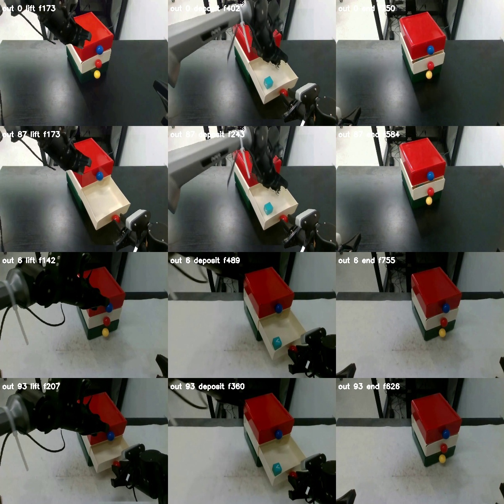

# 均匀抽屉管线修复记录

原始故障和旧统计保留在 [README](README.md)。本文件记录后续修复，不表示
174 集已全部生成。原数据、旧失败输出和被否决的 receipts 都未覆盖。

## 因果判断

故障版本的 `uniform_position` 使用带 joints 的 drawer 专用分支，不会进入通用协同
`smooth_wait_boundaries` 分支。因此，旧的 10/87 预检结果不是“通用加减速
函数调用错误”直接造成的。问题来自专用路线的语义、所有权和时序假设，
以及均匀采样新增的持物区间约束；部分问题被极端 A/B 相位放大。

## 已确认并修复的问题

1. **源 0 把机械臂碎片当物体。** 错误 object 0 在最初十多帧有约 72%–85%
   的 mask 与机器人重叠。真正物体候选的初始重叠为零，但评分略低。
   现增加“目标初始独立于机器人”的证据检查，规划时也检查旧 checkpoint。
   原生视频的旧缓存可重新解释并选中真实立方体，不需要修改视频 hash。
2. **闭合中间平台被当成握紧。** 源 8 原先选择约 57 mm 平台，其后实际闭合
   到约 35 mm，再次张开仍可能低于旧阈值，导致持物区间包含后续空手动作。
   现识别第一段闭合的稳定低平台和持续重新张开；不跨过空夹爪闭合去寻找
   另一次抓取。≤2 mm 的空夹爪不能作为持有该立方体的证据。
3. **只移除半个物体。** 原生图像将立方体不同色面分成多个候选；选择正确
   运动目标后，初始位置仍可能残留青色小块。现只在拾取前补全相邻同色系
   原位区域，不合并搬运中的轨迹；原位审查会检测小面积新增残影。
4. **规划与合成所有权不一致。** 合成器原来会排除释放后仍粘在左臂 mask
   上的物体，规划器却未做同样处理。两者现复用 `exclude_placed_objects`。
5. **删掉全部开屉后动作。** 原路线直接从 open 跳到 closing，丢失松爪、
   调整和移开动作。现保留这些动作，只压缩被 state/action 共同证明静止的
   区间。B 仍在原 open_frame 完成；后续动作没有被算进 B。
6. **只有某一个停点失败，却判整集无解。** 在原始最高点的 2 mm 区域内，
   按高度/速度优先搜索同一停点的两个变体，记录被拒绝的候选。两者都通过
   才写 planned.json；不允许退到低位抓取姿态冒充“举到最高点”。
7. **刹停空间与时间脱节。** 不再要求整个刹停段都处于“已稳定握紧”的窗口，
   也不把未来完整抽屉扫掠区当作所有时刻的障碍。按左右实际源时钟检查
   state/action 与关闭/拉动中的抽屉；开启后的空腔不作为实体填充。
8. **C 的原始遮挡被当成新增碰撞。** 源 6 的一个阻塞来自原视频已有的成对
   轮廓重叠。复用现有 `original_pair_edge` 规则，只允许同一源帧、两臂同时
   前进一步的原速回放；不能错位、跳帧或延长该片段。所有这种边均记账。
   这保留原始数据，不代表对原始物理接触作了新的安全认证。
9. **右臂后续等待缺少平滑支持。** 在 B 完成后的等待使用共享 0.5/0.3 秒
   时钟，再重新调度验证。受保护的 B 前缀不会变长。
10. **过期结果可能混入交付。** 新增源映射摘要、场景参数校验，以及 finalize
    对过期 producer、视觉否决、缺失语义证据和不合法成对回放的拒绝。

## 源 0 的恢复

复用原生 trim 视频对应的测量缓存，约 98 秒完成重新解释。新的分析选择
object 1，原位约 `(238.15, 316.61)`，pickup=301，视觉 grasp=309，release=377。
数值持物区间排除了空夹爪，等待点恢复到源帧 322，TCP Z 约 0.233995 m，
夹爪约 35.2 mm。没有把 640×362 sample 的 manifest 改写成原生视频的 hash。

修正后的阶段抽查能看到左臂、原位物体消失，以及立方体出现在抽屉内；
原先残留的青色小块已消除。阶段截图不是逐帧物理或视觉质量认证。



## 最新执行位置

Coder A 仓库仍为 `/home/coder/share/real-robot-data-retime-main`。本次独立工作根目录：

`/home/coder/share/drawer-uniform-fix-20260911`

只使用本节最后更新的配置和统计，其他带 `probe`、`search` 或版本后缀的目录
是诊断记录，不能按目录或 exit 文件数量统计成功样本。无界候选搜索曾选到
低位抓取点，该诊断结果已拒绝，没有作为正常 Episode 导出；最终实现保留
原始最高点 2 mm 约束。

原始失败样本仍在旧目录的 `rejected_visual_receipts`，不要恢复到成功目录。

## 剩余验收边界

原始要求仍为每源两条、归一化位置相差 0.5、共174条；没有改采样范围，
没有复制成功源或生成空占位。规划通过只是当前模型下可调度，不是视觉验收。
几何模型仍需核对实际抽屉尺寸和 TCP 周围的物体包围半径。默认 24×20×7 cm
及半径3.5 cm 是继承的保守估计，不能把其拒绝一律解释成真实物理碰撞。

如参数确认后仍无解，需检查源证据及该固定 A/B 相位是否存在可行轨迹；
不能靠降低举高阶段、扩大 B 或忽略检查凑满174条。

## 最终复测结果与继续运行

最终代码在全量 87 个源上完成预检：**29 个源的两个变体通过规划**；旧结果为
10 个且包含源0错误通过。通过源为：

`0, 1, 2, 3, 4, 5, 6, 10, 13, 20, 21, 46, 49, 52, 53, 54, 56, 57, 58, 59, 66, 70, 79, 81, 82, 83, 84, 85, 86`。

其余 58 个源：47 个没有满足当前条件的最高点候选，10 个最高点候选均无法
同时满足两种相位，1 个没有可靠的闭合区间。完整结果含当前 producer、配置
及逐源原因，见 [recovery-preflight.json](recovery-preflight.json)。这些不是
“58个真实物理任务不可能”的证明，仍需核对尺寸、轨迹和源证据。

实际重生成并检查了源0/5/6/10的两条变体，共8条输出：

| 源 | 输出 | 帧数 | 等待源帧 | 原始成对边回放 |
| --- | --- | ---: | ---: | ---: |
| 0 | 0 / 87 | 751 / 585 | 322 | 0 / 0 |
| 5 | 5 / 92 | 744 / 614 | 345 | 0 / 0 |
| 6 | 6 / 93 | 756 / 627 | 383 | 29 / 29 |
| 10 | 10 / 97 | 600 / 467 | 347 | 0 / 0 |

验证 action/state 与源时钟的插值在存储精度下完全一致、三个 RGB 视频的
帧数/FPS、原始偏移、A/B/C时序、半区间间隔、源映射摘要及回放边。
原位检查通过，阶段截图已人工查看；这仍不是完整逐帧画质或真机执行认证。
见 [验证记录](recovery-validation.json) 和
[错误源0的拒绝测试](recovery-negative-control.json)。测试为 **164 passed、2 skipped**
（启用了已有 RoboVisualize assets）。

Coder A 最新配置：
`/home/coder/share/drawer-uniform-fix-20260911/delivery-final-config.json`，
仓库内快照为 [recovery-config.json](recovery-config.json)。该配置修正了源0分析
路径，使用独立的 `delivery-final-work` / `delivery-final-dataset`。模型尺寸仍是
明确标注的未测量估计。**不要继续使用原配置里的错误源0 checkpoint。**

```bash
cd /home/coder/share/real-robot-data-retime-main
export PYTHONPATH=$PWD/src:/home/coder/share/robo-visualize/src
export OMP_NUM_THREADS=2 OPENBLAS_NUM_THREADS=2
export RETIME_PY=/home/coder/share/real-robot-data-retime/.venv/bin/python
$RETIME_PY -m real_robot_data_retime.uniform_drawer \
  --config /home/coder/share/drawer-uniform-fix-20260911/delivery-final-config.json \
  --phase plan --episode 0
$RETIME_PY -m real_robot_data_retime.uniform_drawer \
  --config /home/coder/share/drawer-uniform-fix-20260911/delivery-final-config.json \
  --phase render --episode 0
```

修改代码、源映射或 `scene_geometry` 后必须重新 plan，不得改 hash 让旧计划通过。
上面的数据目录尚不是174集成品；本次8条验证输出另存于 `pilot-final-dataset`。
本次未对部分目录执行全局 finalize，也未上传 HF。

最终复现代码快照在 `runtime-delivery-final/src`，其 Python 源文件与提交版本
一致。早期带 `probe`/`search`/`runtime-final2` 等名字的目录仅作诊断，不能混入
这一轮统计。浏览器预览位于现有本地端口的 `/uniform-recovery/` 路径。

本地另存了源0与源6的两种相位预览及动作曲线：
`/Users/shuyuan/Downloads/drawer-uniform-recovery`。
当前本地预览入口为 `http://127.0.0.1:38766/`；它是诊断预览，不是完整 LeRobot
数据集。若本地服务停止，可在该目录运行 `python3 serve.py --port 38766`。
